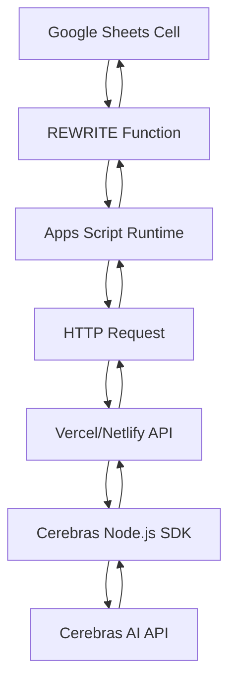

# Design Document

## Overview

The Google Sheets Cerebras AI Integration system consists of three main components:

1. **Google Apps Script Custom Function**: A `REWRITE()` function that users can use directly in spreadsheet cells
2. **Serverless Backend API**: A Node.js API deployed on Vercel/Netlify that integrates with Cerebras AI
3. **Cerebras AI Integration**: Using the official Cerebras Node.js SDK for text processing

The system follows a simple request-response pattern where the custom function sends HTTP requests to the backend API, which processes them through Cerebras AI and returns the results.

## Architecture



### Data Flow

1. User enters `=REWRITE("prompt", A1, B1:C1)` in a cell
2. Google Apps Script executes the custom function
3. Function extracts cell values and constructs API payload
4. HTTP POST request sent to backend API endpoint
5. Backend validates request and calls Cerebras AI SDK
6. Cerebras processes the text and returns response
7. Backend formats response and returns to Apps Script
8. Apps Script returns processed text to display in cell

## Components and Interfaces

### 1. Google Apps Script Custom Function

**File**: `Code.gs`

**Function Signature**:
```javascript
function REWRITE(prompt, mainText, contextCells)
```

**Parameters**:
- `prompt` (string): AI instruction/prompt for text rewriting
- `mainText` (cell reference): Primary text to be rewritten
- `contextCells` (cell reference/range, optional): Additional context for AI

**Key Features**:
- Input validation and sanitization
- Cell value extraction and concatenation
- HTTP request handling with retries
- Error handling and user-friendly error messages
- Caching mechanism to avoid redundant API calls

### 2. Backend API (Vercel/Netlify)

**Framework**: Node.js with Express.js or serverless functions
**Deployment**: Vercel Functions or Netlify Functions

**Endpoints**:

#### POST `/api/rewrite`
**Request Body**:
```json
{
  "prompt": "string",
  "mainText": "string", 
  "contextText": "string (optional)",
  "requestId": "string (for deduplication)"
}
```

**Response Body**:
```json
{
  "success": true,
  "data": {
    "rewrittenText": "string"
  }
}
```

**Error Response**:
```json
{
  "success": false,
  "error": {
    "code": "string",
    "message": "string"
  }
}
```

#### GET `/api/health`
**Response**: System health status for monitoring

### 3. Cerebras AI Integration

**SDK**: `@cerebras/cerebras_cloud_sdk`

**Configuration**:
- API key management through environment variables
- Model selection (e.g., `llama3.1-8b`, `llama3.1-70b`)
- Request parameters (temperature, max_tokens, etc.)

**Integration Pattern**:
```javascript
import { Cerebras } from '@cerebras/cerebras_cloud_sdk';

const client = new Cerebras({
  apiKey: process.env.CEREBRAS_API_KEY
});
```

## Data Models

### Request Model
```typescript
interface RewriteRequest {
  prompt: string;
  mainText: string;
  contextText?: string;
  requestId: string;
}
```

### Response Model
```typescript
interface RewriteResponse {
  success: boolean;
  data?: {
    rewrittenText: string;
  };
  error?: {
    code: string;
    message: string;
  };
}
```

### Cerebras API Configuration
```typescript
interface CerebrasConfig {
  model: string;
  temperature: number;
  max_tokens: number;
  stream: boolean;
}
```

## Error Handling

### Apps Script Error Handling
- **Network Errors**: Display "Connection Error - Retry in a moment"
- **API Errors**: Display specific error messages from backend
- **Validation Errors**: Display parameter-specific error messages
- **Rate Limit Errors**: Display "Rate limited - Retrying..." with automatic retry

### Backend Error Handling
- **Cerebras API Errors**: Log and return structured error responses
- **Rate Limiting**: Implement exponential backoff with jitter
- **Timeout Handling**: 30-second timeout with retry logic
- **Validation Errors**: Return 400 status with detailed error messages

### Error Codes
- `INVALID_PROMPT`: Prompt parameter is missing or invalid
- `INVALID_TEXT`: Main text parameter is missing or invalid  
- `API_UNAVAILABLE`: Cerebras API is temporarily unavailable
- `RATE_LIMITED`: Rate limit exceeded, retry after delay
- `TIMEOUT`: Request timed out
- `INTERNAL_ERROR`: Unexpected server error

## Testing Strategy

### Unit Tests
- **Apps Script Functions**: Test parameter validation, cell value extraction, HTTP request construction
- **Backend API**: Test request validation, Cerebras SDK integration, error handling
- **Utility Functions**: Test text processing, retry logic, rate limiting

### Integration Tests
- **End-to-End Flow**: Test complete flow from Google Sheets to Cerebras AI and back
- **Error Scenarios**: Test various error conditions and recovery mechanisms
- **Rate Limiting**: Test behavior under rate limit conditions

### Manual Testing
- **Google Sheets Testing**: Test function with various parameter combinations
- **Performance Testing**: Test with large datasets and concurrent requests
- **User Experience Testing**: Verify error messages and loading states

## Security Considerations

### API Security
- **Authentication**: Secure API key management in environment variables
- **Rate Limiting**: Implement per-IP rate limiting to prevent abuse
- **Input Validation**: Sanitize all inputs to prevent injection attacks
- **CORS Configuration**: Restrict origins to Google Apps Script domains

### Data Privacy
- **No Data Storage**: API should not store or log user data
- **Secure Transmission**: Use HTTPS for all communications
- **Error Logging**: Avoid logging sensitive user data in error messages

## Performance Optimization

### Caching Strategy
- **Apps Script Caching**: Cache results for identical inputs using CacheService
- **Cache Duration**: 1-hour cache for identical prompt/text combinations
- **Cache Keys**: Hash of prompt + mainText + contextText

### Rate Limiting
- **Cerebras Limits**: Respect Cerebras API rate limits (varies by plan)
- **Concurrent Requests**: Limit concurrent requests to prevent overwhelming the API
- **Exponential Backoff**: Implement backoff strategy for rate limit handling

### Request Optimization
- **Batch Processing**: Consider batching multiple requests when possible
- **Request Deduplication**: Use requestId to prevent duplicate processing
- **Timeout Configuration**: Optimize timeout values for best user experience